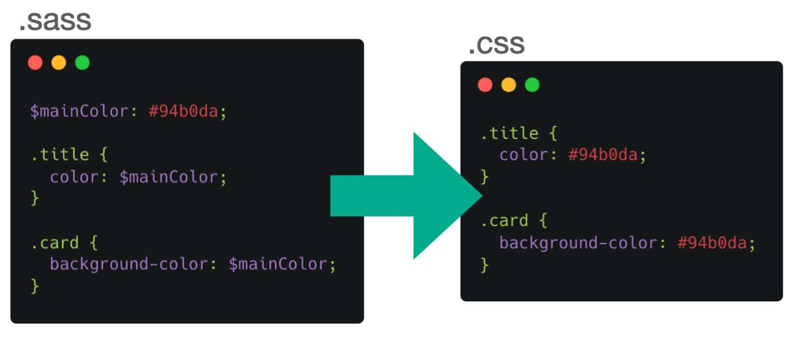

# Teorihandboken - HTML & CSS (HC)
Studerande: mohamed abdi ali 

## HC 1.1 HTML & CSS
Beskriv rubriken här
 Vad är html ?
 HTML, som står för HyperText Markup Language, är centralt för webbutveckling. Det är ett märkspråk som används för att definiera strukturen och organisationen av innehållet på en webbsida. Genom att använda en mängd olika taggar och element kan HTML skapa en meningsfull informationshierarki.
 HTML-dokument är baserade på metaforen att alla dokument kan beskrivas som en hierarkisk trädstruktur. Tänk På saken. Nästan alla dokument kan beskrivas som en hierarkisk trädstruktur. Ta en bok,till exempel. Längst Upp i abstraktions kedjan finns ett antal delar.
 Det finns flera nyckelkoncept men visa av dem är 
 A)Taggar och element:HTMLanvänder taggar för att definiera olika element på webbsida Taggar kapslar innehåller och har eriketter som ger deras betydelse till 
 B)Hierarki och struktur: HTML tillåter att elementbädd i varandra,vilket skapar hierarkisk struktur. Detta skapar en logisk ordning och struktur för innehållet på sidan.
 c) Attribut: Taggar kan innehålla attribut som ger ytterligare information om ett element. En bild kan t.ex. ha ett "src"-attribut som pekar på källan till bilden.
Varje gång vi använder ett element i HTML säger vi något om det innehåll vi har valt att placera i just det elementet. Elementet till exempel till för att betona. Betoning handlar inte bara om presentation. Tänk på följande mening.

A) Semantiska Markering ; Istället för att bara använda taggar för att formatera och utforma text, används semantisk uppmärksamhet för att ge information om innehållets betydelse och struktur. Detta är viktigt för sökmotorer och webbläsare samt för tillgängligheten. Semantisk HTML gör webbsidor mer begripliga och ger en meningsfull struktur.

B) skapa länkar och navigation : Att bygga länkar och navigering är avgörande för en användarvänlig webbplats. En Effektiv navigeringsstruktur gör det lättare för sökmotorer att förstå hierarkin på webbplatsen och förbättrar användbarheten. Det är viktigt att skapa tydliga och begripliga länktexter så att användarna snabbt kan förstå vartlänkarnagår
.

vad är css ?
CSS står för "Cascading Style Sheets" på engelska, vilket direkt kan översättas till "Cascading Style Templates".CSS är ett språk för att beskriva utseendet av en webbsida, inklusive layout, färger och teckensnitt,och separerar det visuella utseendet på en webbsida från dess struktur och innehåll, vilket gör att utseendet på flera sidor kan ändras samtidigt genom att helt enkelt ändra en stilfull.
CSS möjliggör en tydligare åtskillnad mellan innehållet på en webbsida (definierat av HTML eller liknande märkspråk) och dess presentation (definierat av CSS). Detta gör det lättare att ändra utseendet på en webbsida utan att behöva ändra själva innehållet.
En CSS-regel består av en selector, som anger vilket element på sidan som regeln ska gälla för, och en deklaration som innehåller de egenskaper (färg, storlek, position,etc.) som gäller för det valda elementet.
CSS används inom webbutveckling för att styra och definiera det visuella utseendet och layouten.
Genom att använda dessa tekniker och koncept i CSS kan utvecklare skapa ett konsekvent och attraktivt användargränssnitt för sina webbsidor och se till att de fungerar bra på olika enheter och skärmstorlek
När det gäller CSS finns det ett antal viktiga begrepp som du måste förstå för att effektivt kunna använda och skapa stilar för dina webbsidor. Här är några grundläggande och viktiga begrepp:

A) selektor: En selector är en del av en CSS-regel och väljer det HTML-element som regeln gäller för. Det kan vara ett tagg (t.ex. `p `för att tillämpa stilen på alla stycken) eller en klass (t.ex. .header för att tillämpa stilen på alla element med klassen "header").

B) Boxmodellen: Boxmodellen är ett koncept där varje element i html betraktas som en box med olika egenskaper som påverkar layouten, till exempel bredd, höjd, marginaler, utfyllnad och kanter.

Effektiv användning av CSS, som att minimera kod och använda komprimerade stilmallar, kan minska webbplatsens laddningstider. Detta är särskilt viktigt för att förbättra prestanda och användarupplevelse på mobila enheter och på platser med långsammainternetanslutningar.
Sammanfattningsvis är kunskap om CSS och dess begrepp avgörande för att skapa webbplatser som inte bara är visuellt tilltalande, utan också funktionella och användarvänliga. Effektiv användning av CSS kan förbättra en webbplats, prestanda, responsivitet och övergripande kvalitet.

## HC 1.2 Responsiv design
Beskriv rubriken här

Responsiv design är en webbdesign teknik som syftar till att skapa webbsidor som är användarvänliga och ser bra ut på olika enheter och skärmstorlekar. Målet är att ge användarna en konsekvent och tillfredsställande upplevelse oavsett om de besöker webbplatsen från en dator, surfplatta eller mobiltelefon.
Det finns flera sätt dat kan man göra resposive på hemsidor  och här några av dem 
A) media Quries:Media queries är CSS-tekniker som gör att du kan anpassa stilar baserat på egenskaper som skärmstorlek, upplösning och enhetsegenskaper. Exempelvis kan layouten ändras för mindre skärmar eller teckenstorlekar justeras för att underlätta läsning.
B)Fluid images : För att anpassa bilder till olika skärmstorlekar kan en"flytande bild" användas,där den maximala bredden på bilden är inställd så att bilden inte blir för stor på mindre skärmar.
C)Animationer: 

anledning som man använder i Responsive design är Eftersom hälften av alla potentiella besökare använder mobila enheter för att surfa på internet kan sidor som är utformade för datorer inte visas som de är. Det gör det svårare att läsa och använda sidan, vilket leder till en dålig användar upplevelse. Responsiv design innebär också att interaktiva element som knappar och länkar gör slättareattan vända på pekskärmar genom att deras storlek och placering justeras.
Eftersom tekniken och användarnasbeteendeutvecklasblir det allt viktigare att webbplatserärtillräckligtflexiblaförattkunnaanpassastill nya enheter och skärmstorlekar. Responsiv design gör det möjligt för webbplatser att anpassa sig till framtida tekniska innovationer och förändringar.

Sammanfattningsvis används responsiv design för att hantera dagens varierande enhetslandskap och en förbättrad och konsekvent användarupplevelse över olika plattformar, vilket resulterar i förbättrad tillgänglighet och tillfredsställelse för webbplatsbesökare.

</a>

## HC 1.3 Tillgänglighet inom webb
Beskriv rubriken nedan här

Tillgänglighet inom webbutveckling avser att skapa webbsidor och webbapplikationer som kan användas av alla, oavsett förmåga och funktionsnedsättning. Målet är att göra digitalt innehåll tillgängligt och användbart för så många människor som möjligt, inklusive personer med synnedsättning, hörselnedsättning, motoriska svårighete.
Bild alt-text: Tillhandahåll alternativ text (alt-attribut) för bilder så att personer med synnedsättning kan förstå bild innehållet genom skärmläsare. Kontrast och färg: Se till att det finns tillräcklig kontrast mellan text och bakgrund för att förbättra läsbarheten, särskilt för personer med synnedsättning. Undvik att använda färg som enda indikation på information.
måste  webbplats är fullt funktionsduglig och endast kan användas med tangentbordet. Många användare med dålig motorik använder tangentbordet istället för musen.
Tillhandahåll textbaserade alternativ eller transkriptioner för multimedia element som ljud- och videofiler för att hjälpa användare med hörselnedsättning.

Webbtillgänglighet används av en mängd olika skäl, men syftet är att skapa en inkluderande digital miljö där alla användare, oavsett förmåga eller funktionshinder, kan komma åt och använda webbinnehåll på ett effektivt sätt. 
Många företag och organisationer inser också de affärsmässiga fördelarna med tillgänglighet. Ökad Tillgänglighet ökar den potentiella målgruppen och skapar en positiv och inkluderande varumärkesimage
Teknikutveckling är allt viktigare i takt med att användningen av digital teknik ökar. Många använder digitala plattformar för att söka information, handla, studera och delta i samhället. Tillgänglighet är därför avgörande för att alla ska kunna dra nytta av dessa digitala möjligheter.
Skapandet av tillgängliga webbmiljö följer de etiska principerna om likabehandling och rättvisa. Det återspeglar ett engagemang för att skapa teknik och digitala lösningar som gynnar samhället som helhet.
I Den digitala världen är tillgänglighet en grundläggande och nödvändig princip för en inkluderande och rättvis digital framtid. Att skapa tillgängliga webbplatser och applikationer är inte bara ett lagkrav,utan också en integrerad del av ansvarsfull webbutveckling och design.

## HC 1.4 Aktuella webbstandarder (gällande och kommande standarder)
Beskriv rubriken nedan här
vad är Webbstandarder ?
Webbstandarder är rekommendationer från World Wide Web Consortium (W3C) och andra standardiseringsorganisationer om hur man skapar och tolkar webbaserat innehåll. Webbstandarder har funnits sedan webbens tidiga utveckling,men det är först på senare år som de har fått brett stöd av de stora webbläsarna.
Webbstandarder finns till för att säkerställa hållbarheten iden information som publiceras på webben,samtidigt som den görs tillgänglig för så många webbanvändare som möjligt. Webbplatser som utvecklats enlighet med webbstandarder.
API-utveckling Framtida Standardisering Kan introducera nya webb-API:er som underlättar utvecklingen av avancerade webbapplikationer, inklusive realtidskommunikation, maskininlärning och andra avancerade funktioner.
Förbättringar av säkerheten Kommande standarder kan komma att innehålla säkerhetsförbättringar och rekommendationer för att hjälpa utvecklare att bygga säkrare webbapplikationer och skydda användarnas integritet
Ny teknik och nya standarder kan fokusera på att förbättra webbplatsens prestanda, t.ex. genom att minska sidorna, laddningstider och förbättra resurshanteringen.
Webstandarder gör det möjligt att utveckla webbsidor och webbapplikationer som fungerar korrekt i olika webbläsare. Detta Minimerar risken för att användare stöter på problem på grund av inkonsekventa webbplatser på olika plattformar.En enhetlig upplevelse Genom att använda gemensamma webbstandarder säkerställa en konsekvent upplevelse på olika enheter och i olika webbläsare. Detta är avgörande för att ge en konsekvent och förutsägbar upplevelse oavsett vilken enhet en användare använder.
Webstandarder möjliggör global tillgänglighet av webbsidor. Användare Kan komma åt och interagera med innehåll på ett standardiserat sätt, oavsett plats eller enhet.

Sammanfattningsvis används webbstandarder och teoretiska begrepp för att skapa webbupplevelser som är konsekventa, tillgängliga, enkla att underhålla och framtidssäkra. Dessa standarder underlättar också samarbete och innovation inom webbutveckling.

## HC 1.5 CSS Pre-processorer (ex SASS/LESS)
Beskriv rubriken nedan här
CSS-processorn är verktyg och språk som används för att skriva CSS-kod på ett mer effektivt och hållbart sätt. De bygger på konceptet "förbehandling", vilket innebär att man skriver kod med ett specifikt preprocessors språk och kompilerar det till vanlig CSS som webbläsare kan förstå och tolka. Två av de mest populära CSS-pre-processorerna är SASS (Syntactically Awesome Style Sheets) och LESS.
CSSpreprocessorvariabler, som SASS och LESS, lagrar värden så att de kan användas på olika ställen i CSS-koden. Detta gör koden mer dynamisk och lättare att underhålla. 
variabler kan användas för olika typer av värden till example färger.text eller storlek och avstånd. De gör också lättare att ändra desig och globalt viket ger koden en tydligare och mer underhållbar struktur till  ex. 
A)variabler :$ primary-color :# 0000db ;{
background-color:$ primary-color;
}
B)import: det används för att dela upp kod i flera file ich organisera dem .
 @ import " vaiables";
 body {
    background-color:$ primary-color :# 0000db ;
 }
 CSS-processorn kräver en kompileringsprocess:kodskrivsmedhjälpavSASS-syntaxen, som sedan kompileras till vanlig CSS. Detta är ett steg som sker innan koden når webbläsaren.
Dessa exempel ger en översikt över hur dessa nyckelbegrepp används i SASS. För Att testa dessa exempel behöver du en SASS-kompilator (om den inte finns inbyggd i din utvecklingsmiljö). För Att kompilera SASS till CSS kan du också använda online verktyg eller kommandoradsverktyg som sass.

Att använda en CSS-för processor som SASS eller LESS kan vara fördelaktigt i flera scenarier,beroende på projektets krav, teamets arbetsmetoder och webb utvecklingsprocessen. I stora projekt kan användningen av variabler, nesting och mixins öka kodens läsbarhet och underhållbarhet. När Stilarna är organiserade och återanvändbara blir det lättare att hantera och uppdatera koden

Trots Dessa fördelar är det viktigt att notera att CSS-pre processorer också har vissa nackdelar och kan vara överflödiga i små projekt eller medenendautvecklareBeslutetattanvändaen CSS-preprocessor baseraspå projektets behov och krav och bör noggrant övervägas Hänsyn bortaställ.

</a>

## HC 1.6 Optimering och validering av HTML & CSS
Beskriv rubriken nedan här

vad är optimering?
Optimering inom webbutveckling avser processen för att förbättra prestanda, laddningstider och effektivitet för webbsidor. Det omfattar en rad åtgärder för att minimera filstorleken, minskar HTTP-förfrågningar och se till att sidorna laddas snabbt och smidigt för användarna.

Optimering förbättrar prestandan genom att minska filstorlek och nedladdningstider. Detta Är särskilt viktigt med tanke på användarnas ökade krav på snabba,responsiva webbsidor.
 Bättre användarupplevelseSnabbare nedladdning och responsiv design bidrar till en bättre övergripande användarupplevelse. Användare tenderar att föredra webbsidor som laddas snabbt och anpassar sig smidigt till olika enheter
Sökmotoroptimerad Optimerade Webbsidor tenderar att rankas högre på sökmotorernas resultatsidor. Genom att använda semantisk HTML och följa bästa praxis för sökmotoroptimering (SEO) kan webbutvecklare öka sin synlighet på webben.

vad validering ?
Validering är en process där man kontrollerar att koden på en webbsida överensstämmer med fastställda standarder och regler för HTML och CSS. Valideringen Utförs Med hjälp av verktyg som W3C Markup Validation Service för HTML och W3C CSS Validation Service för CSS. Validering Av Kod Säkerställer Att den är korrekt skriven och följer officiella specifikationer, undviker kompatibilitetsproblem och säkerställa en konsekvent upplevelse i olika webbläsare och enheter.
Semantisk html och css -valideringförbättrar tillgängligheten på webbsidor och gör det lättare för användare med funktionsnedsättning att navigera och förstå innehållet 

Befintliga webbplatser För befintliga webbplatser är optimerings- och validering granskningar användbara för att förbättra prestanda, eliminera buggar och upprätthålla överensstämmelse med de senaste standarderna. För mobiler och långsamma nätverk optimering är särskilt viktigt för mobilanvändare och användare av långsamma nätverk. Minskade filstorlekar och effektiv resursanvändning kan förkorta laddningstiderna.

Sammanfattningsvis är optimering och validering viktiga processer för att skapa och underhålla webbsidor av hög kvalitet. Dessa koncept bidrar till en bättre användarupplevelse, förbättrad tillgänglighet och långsiktig hållbarhet för webbutvecklingsprojekt.

## källor
http://htmlhunden.se/dist/full.html 

https://www.happiness.se/artiklar/vad-ar-webbstandarder  

https://raygun.com/blog/css-preprocessors-examples/  