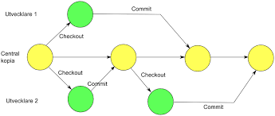

# Teorihandboken - Programmeringsmetodik (PG)
Studerande: Mohamed abdi ali

## PG 1.1 Versionshantering (Git)
Beskriv rubriken här
Git Versionskontroll, särskilt med verktyg som Git, är en grundläggande del av mjukvaruutveckling och samarbete. Git är ett distributionsformat för versionskontrollsystem som effektivt hanterar ändringar av källkoden över tid. Utvecklare runt om i världen använder det för att spåra och hantera ändringar i sina projekt. Här är en översikt över några nyckelbegrepp och operationer i Git:
Repository : Ett Git-förråd är en samling filer och mappar som utgör ett projekts källkod, tillsammans med all historik och metadata som Git använder för att spåra ändringar.

Commit:En commit är en ögonblicksbild av de ändringar du har gjort i ditt projekt vid en viss tidpunkt. Det är en enhet för att spåra och hantera ändringar i Git. När du vill spara ändringar i ditt lokala arkiv utför du en commit..

Branch (Gren): Grenar Är oberoende utvecklingslinjer. De Kan också ses som versioner av ett projekt. Med hjälp av grenar kan du testa nya funktioner och göra ändringar utan att påverka huvudgrenen (ibland kallad "master" eller "main").

Merge: När du har utvecklat en funktion eller gjort ändringar i en gren, kan du slå samman funktionen tillbaka till huvudgrenen genom en sammanfogning operation.Detta innebär att ändringar från den andra grenen kommer att återspeglas i huvudgrenen

pull Request:En pull-begäran är en mekanism för att föreslå ändringar från en gren till en annan, vanligtvis från utvecklingsgren till mastergren. Andra utvecklare kan granska ändringar och ge feedback innan de slås samman.
Konfliktlösning: Ibland kan konflikter uppstå när Git försöker slå samman ändringar från olika grenar. Detta händer när två ändringar påverkar samma rad i filen. Konflikter måste lösas manuellt.

Push and Pull: Push används för att ladda upp lokala ändringar till fjärrförvaret, medan pull används för att hämta ändringar från fjärrförvaret till en lokal kopia.
Klona: Klona ett arkiv innebär att du skapar en kopia av det på din lokala dator.
Att förstå och kunna använda dessa grundläggande operationer i Git är avgörande för att arbeta effektivt med programvaruprojekt och samarbeta med andra utvecklare. Det finns också många avancerade koncept och funktioner i Git som du kan utforska när du blir mer bekant med den.

 </a>

## PG 1.2 Benchmarking
Beskriv rubriken här
vad är benchmarking ?
Benchmarking är en strategisk metod som används för att jämföra och utvärdera en organisations prestation, processer, produkter eller tjänster med konkurrenter eller andra ledande företag i samma bransch eller till och med utanför branschen. Syftet med benchmarking är att identifiera bästa praxis, lära av andra och sedan tillämpa dessa insikter för att förbättra din egen prestation, kvalitet och konkurrenskraft.

Inom IT-branschen avser benchmarking jämförelse och utvärdering av olika aspekter av IT-drift, processer och tekniska lösningar för att förbättra prestanda, effektivitet och konkurrenskraft. Här är några specifika områden där benchmarking är vanligt inom IT-branschen.
A) Teknisk Infrastruktur: Inom teknisk infrastruktur involverar benchmarking en djupgående titt på nätverkskapacitet ens bandbredd, serverprestanda (inklusive processorkraft och minne), tillgänglighet och skalbarhet för lagringslösningar samt tillförlitlighet och flexibilitet för analys av molntjänster. Genom att noggrant utvärdera dessa faktorer kan organisationer upptäcka och lösa potentiella flaskhalsar eller ineffektivitet i sin IT-infrastruktur. Det kan innebära att optimera serverkonfigurationen, gå över till effektivare lagringslösningar eller anpassa användningen av molntjänster för att bättre möta företagets behov och krav på tillgänglighet, prestanda och säkerhet.
B)Säkerhet och dataskydd: När det gäller säkerhet och dataskydd möjliggör benchmarking en grundlig bedömning av en organisations säkerhetsarkitektur, inklusive brandväggar, system för intrångsdetektering och krypteringsprotokoll. Det omfattar också en analys av säkerhetspolicyn och förfaranden för att hantera säkerhetshot, incidenter och dataintrång. Genom att jämföra dessa med branschstandarder och bästa praxis kan organisationer identifiera områden där säkerhetsförbättringar behövs. Det kan handla om att införa multifaktorautentisering, utbilda personalen och öka säkerhetsmedvetandet samt införa avancerade verktyg för hotanalys för att förbättra förmågan att upptäcka och hantera cyberhot.

C) IT-tjänstehantering och kundsupport: inom IT-tjänstehantering och kundsupport kan benchmarking användas för att jämföra och bedöma en organisations förmåga att tillhandahålla IT-tjänster och support till användare och kunder. Detta inkluderar analysaspekter som genomsnittlig svarstid, snabb problemlösning, kundnöjdhet och incidenthantering. Benchmarking Mot branschledande standarder och bästa praxis kan hjälpa organisationer att identifiera områden där IT-tjänstehantering och kundsupport kan förbättras, till exempel genom att minska svarstider, förbättra incidenthanteringsprocess och implementera bättre verktyg för övervakning och rapportering av kundnöjdhet.Kan.

 </a>

## PG 1.3 Testdriven utveckling
Beskriv rubriken här
vad är testdriven utveckling eller TDD ?
Testdriven utveckling(TDD)är en viktig aspekt av programvaruutveckling processen. Detta tillvägagångssätt gör det lättare att testa vad en viss kod gör. Testfall skapas för varje funktion i programvaran och även viss funktioninteklarartestetomarbetaskoden och nykodskapas. Den nya koden måste också klara testerna och vara felfri. Utvecklarna behöver bara skriva nykod om de automatiserade testerna för den koden misslyckas, så att det finns ett testfall för även den minsta funktionaliteten. Och TDD innebär att man utformar och utvecklar tester för varje funktion i applikationen.
Testdriven utveckling (TDD) är en utvecklingsmetod som fokuserar på att skriva tester först,innan man skriver kod. Denna metod har flera viktiga fördelar

A) Testfall-per funktion: TDD skapas testfall för varje del av koden och varje funktion i programvaran. Detta säkerställer att varje del av koden fungerar som förväntat och gör det möjligt att upptäcka fel tidigt i utvecklingsprocessen.
B)Automatiserad Testning: testfall för TDD är vanligtvis automatiserade och körs automatiskt när koden ändras. Det Sparar tid och minskar risken för mänskliga fel.

C)Inkrementell utveckling: TDD underlättar en inkrementell utvecklingsprocess,där koden gradvis byggs upp baserat på testfall. Detta gör att utvecklarna kan identifiera och korrigera fel tidigt i processen.
D)Kontinuerlig integration: TDD fungerar bra med kontinuerlig integration (CI), där kodändringar regelbundet integreras i huvudkudden. Förekomsten av Automatiserade tester gör att vi-processen kan löpa smidigt och effektivt.

E)Kvalitetssäkring: TDD främjar en hög grad av kodtäckning.Det Innebär att testfallen täcker så mycket av koden som möjligt. Detta minskar risken för otestad kod och förbättrar kvaliteten på slutprodukten.
Kontinuerlig förbättring: Genom att använda TDD skapas en kultur av kontinuerlig förbättring inom utvecklingsteamet. Utvecklarna strävar efter att förbättra kvaliteten på koden genom att skriva bättre testfall och identifiera och åtgärda fel i koden.

Sammanfattningsvis är testdriven utveckling en kraftfull metod som främjar ett strukturerat, kvalitetsinriktat tillvägagångssätt för programvaruutveckling. Genom att först skriva testfall och sedan skriva kod som uppfyller dessa testfall kan utvecklarna skapa mer tillförlitlig och robust kod samtidigt som risken för buggar och regressioner minskar

## PG 1.4 Deploy och staging
Beskriv rubriken här
vad är deploy ?
Den kritiska fasen där kodändringar överförs från en utvecklingsmiljö till en produktionsmiljö är deployment, även kallad implementering. Den sista delen av utvecklingsprocessen innebär att utvecklare tar den färdiga koden och gör den tillgänglig för användare. Det är möjligt att deploymentprocessen är komplicerad och kräver noggrann planering och validering för att säkerställa att ändringarna går smidigt och att inga oförutsedda problem uppstår i produktionen.

Deployments Processen består av flera avgörande steg:

A)Preparation: Koden måste förberedas för distribution innan deployment börjar. Att paketera och komprimera filer, skapa säkerhetskopieringar och backuper av databaser och genomföra eventuella ändringar eller korrigeringar i sista minuten är några exempel på vad som kan ingå i detta.

B)Verifiering: Efter förberedelserna måste koden valideras för att säkerställa att den är korrekt och fungerar som förväntat. Innan de går till produktionsmiljön är det nödvändigt att utföra en mängd olika tester, såsom systemtester, integrationstester och enheter, för att hitta eventuella fel.

C)Distribueras: Koden kan överföras till produktionsmiljön när den har validerats och testats framgångsrikt. Det är möjligt att göra detta manuellt genom att överföra filer och uppdatera databaser, eller det kan göras automatiskt genom att använda automatiserade system och verktyg för att effektivisera processen.

D)Observation: Efter distributionen måste de nya tilläggen noggrant övervakas för att se till att allt fungerar som förväntat i produktionsprocessen. Detta inkluderar att spåra prestanda, ta itu med problem eller fel och se till att ändringarna inte påverkar användarna negativt.

vad är stagin?
Staging Miljön är en viktig del av IT-utveckling och används för att testa och validera ändringar av mjukvara innan den släpps live i produktionsmiljön. Utvecklare och testare kan testa hur nya funktioner eller uppdateringar kommer att fungera genom att modellera produktionsmiljön.

 </a>

## PG 1.5 Debugging
Beskriv rubriken här

vad är debugging ?
Debugging  är en av de svåraste och tidskrävande stadierna i mjukvaruutvecklings cykeln och är en nödvändig och avgörande del av processen. En bugg kan komma från ett kodfel, en logisk brist, oförutsedda data förhållanden eller till och med en kombination av flera faktorer. Det krävs en kombination av tekniska färdigheter, problemlösningsförmåga och noggrannhet för att identifiera och lösa dessa problem. Att förstå den grundläggande källan till fel är en viktig del av debugging. Ett fel kan ibland vara lätt att se och identifiera, som ett stavfel eller ett syntaxfel i koden. I andra situationer kan problemet vara mer komplicerat och kräva djupare undersökningar för att förstå dess ursprung. Det är vanligt att en bugg har flera orsaker, och det kan krävas att gräva djupt in i koden för att hitta och åtgärda varje problem.
Utvecklare använder en mängd olika tekniker och verktyg för att underlätta debugging. Utvecklare använder ofta stegvis exekvering av koden, vilket innebär att de stegar igenom koden rad för rad för att spåra variabler och kontrollera hur programfältet utvecklas. Utvecklare kan använda breakpoints för att pausa körningen vid vissa punkter i koden för att se dess tillstånd. Dessutom är loggfiler avgörande för debugging eftersom de kan användas för att spåra programflödet och hitta problem eller oönskat beteende.
Debugging kan dock vara en svår och irriterande uppgift. Buggar kan ibland vara svåra att reproducera, vilket gör det svårt att hålla dem borta och sköta dem. Dessutom kan ett felaktigt tillvägagångssätt orsaka nya problem eller biverkningar som kräver ytterligare testning och debugging.
Trots svårigheterna är debugging en viktig del av mjukvaruutveckling processen och krävs för att producera programvara som är robust och pålitlig. Utvecklare kan effektivt identifiera och lösa problem, vilket förbättrar användarupplevelsen för den färdiga produkten genom att förstå olika debugging tekniker och använda lämpliga verktyg.

Sammanfattningsvis är debugging en viktig process för mjukvaruutveckling som syftar till att identifiera, isolera och korrigera programvarufel. Det är en komplicerad och tidskrävande uppgift som kräver teknisk kompetens, problemlösningsförmåga och noggrannhet. Utvecklare kan spåra och åtgärda problem i koden genom att använda verktyg som loggfiler, breakpoints och stegvis exekvering. Trots svårigheterna är debugging avgörande för att skapa robust och pålitlig programvara, och att kunna utföra denna process effektivt är avgörande för framgångsrik mjukvaruutveckling.

## PG 1.6 Dokumentation
Beskriv rubriken här
vad är Dokumentation ?
Att skapa och underhålla skriftliga eller digitala dokument som beskriver olika delar av något, som en produkt, system, process eller procedur, kallas dokumentation. Målet med dessa dokument är att ge en organiserad och lättförståelig representation av det dokumenterade objektet så att det blir lättare att förstå, använda, underhålla och vidareutveckla.
Dokumentation är avgörande inom många olika industrier. Till exempel används dokumentation för att beskriva koden, systemarkitekturen, användargränssnittet och andra tekniska aspekter av en programvara i mjukvaruutveckling. Det hjälper utvecklare, användare och andra intressenter att förstå programvarans funktion och hur den ska användas.
Beroende på dess mål och målgrupp kan dokumentation ta en mängd olika former. Det kan vara interaktiva guider, webbsidor, diagram, bilder eller textdokument. Dokumentationen, oavsett format, måste vara lättillgänglig, noggrant utformad och regelbundet uppdaterad för att fortsätta vara användbar och relevant över tiden.
Några vanliga typer av information är:
A)Tekniska dokumatation :Teknisk dokumentation innehåller omfattande information om ett system, arkitektur, komponenter och hur de interagerar med varandra.Beskrivningar av system designmönster, ramverk, databasstrukturer och API-specifikationer kan inkluderas i det.För att hjälpa utvecklare som ska arbeta med koden inkluderar kod kommentarer ofta teknisk dokumentation. Dessa kommentarer förklarar kodens syfte, funktioner, variabler och metoder.Teknisk dokumentation är avgörande för utvecklare och ingenjörer för att förstå systemets struktur och funktionalitet. Det hjälper också till att underlätta systemets underhåll och vidareutveckling över tid.

B)Dokumentation för processen:
Procedur Dokumentation beskriver de olika processer, rutiner och arbetsflöden som organisationen använder för att utföra olika uppgifter och hantera olika situationer.
Det kan inkludera regler, protokoll, arbetsinstruktioner och checklistor som anger hur specifika uppgifter ska utföras.
Dokumentation av procedurer är avgörande för att säkerställa att uppgifter utförs på ett konsekvent och korrekt sätt över hela organisationen och för att göra det lättare för nya medarbetare att lära sig och få kunskap.

C)Specifikationerna för kravet:
De funktionella och icke-funktionella krav som styr produktens eller systemets design och utveckling beskrivs i kravspecifikationer.
Produkter eller system måste utföra vissa funktioner, beteenden och prestandakrav, enligt funktionella krav.
Faktorer som prestanda, säkerhet, skalbarhet och användarupplevelse kallas icke-funktionella krav.
Specifikationer är avgörande för att förstå och definiera vad som förväntas av en produkt eller ett system och för att guida designen och utvecklingen av den i enlighet med användarnas behov och förväntningar.

## PG 1.7 Struktur av kod i projekt
Beskriv rubriken här
vad är Struktur av kod i projekt ? 
Ett projekts kodstruktur beskriver hur och hur koden arrangeras för att skapa programvara. Det är en avgörande del av mjukvaruutveckling eftersom en tydlig kodstruktur gör koden lättare att förstå, underhålla och utöka över tid. En bra kodstruktur ökar också samarbete och effektivitet bland utvecklare som arbetar på samma projekt. Här är några av de viktigaste komponenterna i kodstruktur:

A)Modularisering:Modularisering är processen att dela upp koden i mindre, lättare att hantera delar. Detta innebär att olika funktioner och egenskaper är placerade i separata moduler eller filer. Detta gör koden mer återanvändbar och underlättar felsökning och underhåll.

B) Mappens konstruktion: En mappstruktur som är logisk och konsekvent hjälper till att organisera koden så att det är enkelt att hitta relevanta filer och moduler. Att ha mappar för olika delar av applikationen, som "controllers", "models", "views" osv.

C) Standarder för namngivning: För att göra koden lättare att förstå och underhålla är det viktigt att använda konsekventa namngivningsstandarder för filer, variabler, funktioner och klasser. Utvecklare kan snabbt förstå koden utan att behöva läsa dokumentationen genom att följa standardmetoder.
D) Separation av bekymmer : I enlighet med principen om separation av bekymmer bör olika delar av applikationen, inklusive presentation, affärslogik och dataåtkomst, hållas separata från varandra. Dessutom gör det koden lättare att förstå och ändra.
E) Dekkumantation:För att förklara kodens syfte, funktion och användning måste den kompletteras med kommentarer och dokumentation. Denna funktion gör det lättare för andra utvecklare att förstå och arbeta med koden.

Formatering av kod: Koden blir lättare att läsa och underhålla om den hålls i en konsekvent kod formatering. Utvecklare kan skriva enhetlig kod som är lättare att arbeta med genom att följa en kodningsstandard eller stilguide.Kontroll av versioner: Utvecklare kan samarbeta och hålla reda på ändringar i koden genom att använda en versionshantering plattform som Git. Detta är särskilt viktigt när flera utvecklare arbetar på samma projekt.Automatisk bedömning: Automatiska testfall hjälper till att säkerställa att koden fungerar korrekt och inte bryter upp befintlig funktionalitet när ändringar görs. Detta minskar sannolikheten för buggar samtidigt som kvaliteten på koden förbättras.

Sammanfattningsvis är strukturen av kod i ett projekt avgörande för att upprätthålla en robust och stabil kodbas. Utvecklare kan skapa kod strukturer som uppmuntrar samarbete, underlättar underhåll och möjliggör skalbarhet över tid genom att använda principer som dokumentation, modularisering och namngivningskonventioner.

Staging Miljön spelar flera avgörande roller inom IT-utveckling:

A)Testning och verifiering: En mängd olika tester och valideringar kan utföras i handlings miljön. Dessa inkluderar funktionsprövning, prestandatestning, användaracceptans testning och säkerhetstestning. Utvecklare och testare kan hitta och fixa eventuella problem innan de når slutanvändarna genom att simulera produktionsmiljön.

B)Minimering av risker: Genom att använda stagnation miljön kan företag undvika att göra misstag eller fel i produktionsmiljön. Genom att tillåta ändringar att testas och valideras noggrant innan de släpps live kan problem upptäckas och åtgärdas tidigt, vilket minskar risken för att negativa effekter på användarupplevelsen uppstår.

C) Kommentarer och utvärdering: Innan produktionsmiljön ändras kan hanterings miljön samla in feedback från intressenter och slutanvändare. Detta låter företag göra sista minuten-justeringar eller förbättringar baserat på feedback innan ändringarna släpps live

 </a>

## PG 1.8 Automatisering av arbetsflöde
Beskriv rubriken här
vad är Automatisering av arbetsflöde ?
Att använda verktyg och teknologi för att automatisera och effektivisera vanliga processer i ett arbetsflöde kallas automatisering av arbetsflöden. Upprepade uppgifter, manuella processer och sekvenser av händelser kan automatiseras för att spara tid, minska fel och öka produktiviteten.
Inom IT-branschen handlar automatisering av arbetsflöden om att använda verktyg och teknik för att automatisera och effektivisera processer och rutinuppgifter relaterade till IT-tjänster, infrastruktur och utveckling. Att distribuera och övervaka mjukvaruuppdateringar, övervaka nätverksaktivitet och hantera användarbehörigheter är några av de möjliga uppgifterna. Här är några vanliga användningsområden för automatisering av arbetsflöden inom IT:
Utdelning av programuppdateringar: IT-avdelningar kan automatisera distributionen och tillämpningen av mjukvaruuppdateringar på klient- och serverdatorer. Detta minskar behovet av manuella åtgärder och garanterar att systemen alltid är uppdaterade med den senaste programvaran.
Konfigurationskontroll: Det är möjligt att använda automatisering för att hantera och upprätthålla en konsekvent konfiguration av en mängd olika enheter och system i en IT-infrastruktur. IT-avdelningar kan automatisera konfigurationsändringar för servrar, nätverksenheter och molntjänster genom att använda verktyg som Ansible, Puppet och Chef.
Säkerhet och åtkomstkontroll: Det är möjligt att automatisera hanteringen av användarbehörigheter, säkerhetspolicyn och åtkomstkontroller för ett antal system och applikationer. IT-avdelningar kan hantera säkerhetscertifikat och automatisera processer för att tilldela och återkalla användarbehörigheter genom att använda identitets- och åtkomsthantering verktyg som Active Directory, LDAP och OAuth.IT-branschen är det första steget att automatisera arbetsflödet att identifiera de uppgifter och processer som är lämpliga för automatisering. För att implementera och automatisera dessa arbetsflöden måste man sedan välja lämpliga plattformar och verktyg. Det är också nödvändigt att kontinuerligt planera, testa och övervaka automatiseringen för att säkerställa att den fungerar som avsett och uppfyller yrkeskraven.

## PG 1.9 Virtualisering av utvecklingsmiljö
Beskriv rubriken här
vad är Virtualisering av utvecklingsmiljö?
Inom mjukvaruutveckling innebär virtualisering av utvecklingsmiljöer att använda verktyg och tekniker för att skapa en separat och konsekvent utvecklingsmiljö.För att förbättra och underlätta utvecklingsarbetet används virtualisering av utvecklingsmiljön som en programmeringsmetodik. Detta inkluderar användningen av virtualisering verktyg som containrar och virtuella maskiner (VM) för att skapa isolerade och konsistenta utvecklingsmiljöer. Här är några komponenter som kan användas för att integrera virtualisering av utvecklingsmiljön som en programmeringsteknik:
A) Avdelning och uppsättning för varje projekt:
Förmågan att separera utvecklingsmiljön för varje projekt är en stor fördel med virtualisering. Det betyder att varje projekt kan använda sina egna unika bibliotek, ramverk och verktyg utan att påverka andra projekt. Detta minskar risken för konflikter och beroenden mellan olika projekt och gör det lättare att hantera de unika kraven och kraven för projektet.
B) Applikation Uppsättningen som kan köras:
Containrar kan användas för att skapa en uppsättning av applikationer som kan användas i realtid och som innehåller alla dess beroenden och resurser. Sedan kan denna uppsättning spridas och köras på en mängd olika miljöer och plattformar utan att behöva oroa sig för beroenden eller kompatibilitetsproblem. Detta gör distribution och hantering av applikationen i produktionsmiljöer lättare.

C) Skalbarhet och resurshantering:
Skala upp och ned är möjligt med både virtuella maskiner och containrar beroende på behov. Detta gör det möjligt att effektivt hantera resurser och skala infrastrukturen för att möta belastningen och behoven hos applikationen. Man kan till exempel enkelt skala upp mängden containrar för att hantera en ökad belastning på en webbapplikation.
D) Att undvika lokala konfigurationer:
Genom att använda virtualiserade utvecklingsmiljöer istället för lokala konfigurationer kan man undvika problem som uppstår när man försöker flytta applikationen från utvecklingsmiljön till produktion. Utvecklare kan istället arbeta i en miljö som är nästan identisk med produktionsmiljön, vilket minskar sannolikheten för problem och gör det lättare att överföra applikationen till produktion.

Sammanfattningsvis gör virtualisering av utvecklingsmiljöer det mer effektivt och säkert att arbeta med utveckling genom att göra miljön portabel och lätt att distribuera och hantera. Detta minskar sannolikheten för fel och komplikationer i utvecklingsarbetet och ökar samarbetet och produktiviteten i teamet.

## PG 1.10 Bundeling-verktyg
Beskriv rubriken här

Programmering kan använda bundling-verktyg för att samla och organisera de olika resurser som behövs för en webbapplikation eller ett projekt. JavaScript-filer, CSS-stilar, bilder, fontfiler och andra relaterade filer kan vara en del av dessa resurser. Ett bundling-verktyg gör det möjligt att hantera och optimera resurser för att förbättra prestanda och användarupplevelse.
Webpack:Webpack är ett populärt och kraftfullt handlingsprogram för webbutveckling. Det har förmågan att hantera en mängd olika filer och moduler och skapa en paketstruktur som är optimerad för webbapplikationer. Dessutom inkluderar Webpack ett antal plugins och verktyg för att förbättra och optimera prestanda för webbapplikationer.
Paket: Parcel är ett snabbt och enkelt handlingsprogram som tillåter automatisk konfiguration och beroende hantering. Det kräver inte mycket konfiguration och kan hantera en mängd olika filer och resurser, såsom JavaScript, CSS, HTML och bilder, bland andra. Browserify är ett bundling-verktyg som syftar till att göra Node.js-moduler tillgängliga för webbläsare. Det gör det möjligt för npm-moduler och andra Node.js-bibliotek att användas i projekt som är webbläsarbaserade genom att konvertera dem till ett format som webbläsaren kan läsa.
Rollup är ett modulbaserat bundling-verktyg som är inriktat på att skapa JavaScript-paket som är små men effektiva. Genom att ta bort oanvänd kod och optimera import- och export anrop skapar det vanligtvis mindre bundlar än andra verktyg, vilket gör det särskilt användbart för biblioteksutveckling.

## PG 1.11 Terminalinterface
Beskriv rubriken här
terminalen är ett användargränssnitt som använder text för att skriva in och utföra kommandon för att interagera med ett datorsystem. Genom att skriva kommandon kan användaren kommunicera direkt med operativsystemet eller annan programvara genom att få återkoppling i form av textoutput.
För det mesta är terminalen en applikation eller ett program som kan öppnas i en fönstermiljö på en dator. Terminalen kallas också shell eller kommandotolk i Unix-liknande system som Linux och macOS. Det kallas vanligtvis kommandotolken eller kommandoprompten i Windows-operativsystemet.
Användaren kan utföra ett brett utbud av uppgifter och åtgärder med terminalen, som inkluderar:
A) navigera på filesystemet :Användaren kan lista filer och kataloger i den aktuella katalogen med kommandon som ls och cd för att byta kataloger.
Användaren kan navigera till olika platser i filsystemet genom att ange en relativ eller absolut sökväg.
För att skapa en ny katalog kan användaren använda kommandot mkdir, därefter namnet på den nya katalogen, och kommandot rm kan användas för att ta bort en fil eller katalog.
Användaren kan använda kommandon som chmod för att ändra filens tillstånd och chown för att ändra filens ägare för att ändra filrättigheter.
B)Hantering av processer För att lista körande processer kan användare använda kommandon som ps och top för att visa en dynamisk lista över de mest aktiva processerna.För att initiera en ny process kan användaren bara skriva in verktygets eller programmets namn, följt av eventuella relevanta kommandon och argument.Användaren kan använda kommandot kill, som följs av processens PID, för att stoppa en pågående process.Kommandot nice kan också användas för att ändra process prioriteter och kontrollera mängden CPU-tid som processen får.

C)Kontroll av versioner: Terminalen används av utvecklare för att arbeta med versionshanteringsverktyg som Git, Mercurial och SVN. De kan klona, skapa grenar, utföra sammanfogningar, bifoga ändringar och hantera en mängd olika delar av sina kodbasen med hjälp av terminalkommandon.
D)Textning och kodning: Textfiler och källkodsfiler kan öppnas och ändras med terminalgränssnittet genom att använda textredigerare som Vim, Emacs eller Nano. Dessa redigerare kan användas av utvecklare för att skriva och redigera kod, navigera i filer, söka och ersätta text och utföra andra operationer som är relaterade till text.

Till slut är terminal gränssnittet ett viktigt verktyg för utvecklare för att utföra en mängd olika uppgifter inom områdena mjukvaruutveckling och systemadministration. Utvecklare kan automatisera uppgifter, öka produktiviteten och få en bättre förståelse för hur deras system fungerar med terminalen.

 </a>

källor  

https://github.com/git-guides 

https://kinsta.com/se/kunskapsbas/git-vs-github/  

https://www.consid.com/sv/insikter/artiklar/testdriven-utveckling-skriv-test-forst-och-kod-sen-med-tdd-metoden/ 

https://support.microsoft.com/sv-se/topic/skapa-strukturkoder-i-project-skrivbordsversion-bb6a61aa-debd-4e38-8c04-8e2c1ae3cbda 

https://umbraco.com/knowledge-base/deployment/  

https://www.techtarget.com/searchsoftwarequality/definition/debugging 

https://www.ninjaone.com/sv/blog/de-5-basta-metoderna-for-it-dokumentation/ 

https://support.apple.com/sv-se/guide/terminal/trmld4c92d55/mac 
https://polaridad.es/sv/Vad-är-en-tipterminal-gränssnittsprocessor-och-hur-fungerar-den%3F/

https://www.konicaminolta.se/sv-se/solutions/production-printing/automatisering-arbetsfloden 

https://powerautomate.microsoft.com/sv-se/benefits-of-rpa-robotic-process-automation/

https://datorteknik1a.diginto.se/operativsystem/virtuella-maskiner/
https://azure.microsoft.com/sv-se/resources/cloud-computing-dictionary/what-is-virtualization  