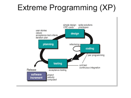
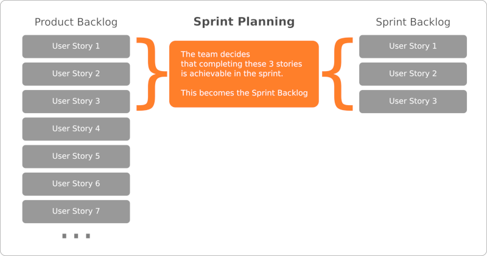

# Teorihandboken - Projektmetodik (PJ)
Studerande: Mohamed abdi ali 

## PJ 1.1 Agila metoder (Scrum, Kanban, Extreme Programming)

Vad är agila?
 Ordet agile kommer från engelska och betyder snabb eller smidig. I en agil miljö innebär denna flexibilitet att kunna hantera förändring, anpassning och minimera osäkerhet och risk som en naturlig del av jobbet. Detta agila manifest för mjukvaruutveckling producerades officiellt 2001 av 17 praktiker och kommer från kärnan av övertygelser om att presentera värde och samarbeta med kunder .Dessa tullar måste först skilja mellan dessa konstruktioner av "lätthetsregler och praxis" som tidigare nämndes i den smidiga deklarationen. Det är väl lämpat för produkter och företag som upplever olika förändringar i sin utveckling"

 Vad menas med agil metodik och agila metoder ? 

Låt oss först skilja mellan termerna "metodologi" och "metod". Metodik kan sägas vara en samlingsbeteckning för uppsättning metoder, ett arbetssätt som skapar en eller flera önskade effekter/värden. Ett enskilt förhållningssätt beskriver ett specifikt förhållningssätt, ett sätt att arbeta som skapar värde. Några exempel på olika agila metoder som kan nämnas är Scrum, Lean Software Development, DSDM och XP, varav den i särklass vanligaste är Scrum.. Alla vet att vi lever i en tid av förändring och osäkerhet, och det är här som agila metoder spelar in och har en sådan genomslagskraft.

Det finns ett mer traditionellt sätt att arbeta är waterfall som är den metod som man tillämpat inom utveckling av projekt under en längre tid .
Waterfall-metoden lämpar sig bäst för projekt där kraven är väldefinierade och sällan förändras under projektets gång.

Scrum är ett agilt ramverk för att hantera och slutföra komplexa projekt. Det utvecklades ursprungligen för mjukvaruutveckling men har sedan dess använts inom olika områden och branscher. Scrum-ramverket betonar iteration och inkrementella framsteg, vilket gör det möjligt för team att anpassa sig till förändringar och leverera värde snabbt.

1:roller: Scrum Master: Ansvarig för att se till att Scrum-teamet följer Scrum-praxis och hjälper teamet att ta bort alla hinder som kan påverka dess produktivitet. Produktägare: Representerar intressenterna och ansvarar för att definiera och prioritera 
2:produktbacklogposterna. Kulturlämningar: Product Backlog: En prioriterad lista över alla funktioner, förbättringar, buggfixar och annat arbete som behöver göras i projektet. 
3:Sprint Backlog: En uppsättning product backlog-objekt som valts ut för sprinten och en plan för leverans av produkt tillskottet. 

Kanban-tavlor är en visuell metod för att hantera arbetsprocesser på individ-, team- eller till och med organisationsnivå. Det uttalas "kahn-bahn" och betyder "visuell signal" eller "kort" på japanska.
Till skillnad från andra metoder för hantering av arbetsflöden som tvingar fram.
Förändringar från början handlar kanban om evolution, inte revolution.Kanban bygger på den grundläggande sanningen att innan du kan nå din önskade destination måste du veta var du befinner dig.
 kanban  kan tillämpas på praktiskt taget alla typer av arbete  som följer ett att göra på går eller klart mönster  kan det hanteras på en kanban tavla .

## PJ 1.2 Icke-agila metoder
Beskriv rubriken nedan här

icke agile metoder är en metoder för mjukvaruutveckling och projektledning som inte motsvarar de principer och värderingar som förknippas med agila metoder som scrum,kanban eller extreme programming fokusera samarbete och leverera värdefull produkter . några exempel är  som icke agila metoder är

A) Waterfall-metoden : det är en traditionell projektledningsmetod där varje fas såsom kravspecifikation,design ,implementation och testning utförs i en strikt ordning .Det finns liten flexibilitet för ändringar efter att en fas har påbörjats. 

B) Rational  Unified process(Rup):är iterativ men ändå icke-agil metodik som fokuserar på formella dokument och processer .Den omfattar fyra faser: Inception, Elaboration, Construction och Transition .

c) Big Design up front(BDF):är ett sätt att specificera alla krav och design i detalj innan implementeringen påbörjas .Detta är motsatsen till agila metoder ,där design och krav kan utvecklas iterativt.

D) Capability maturity model integration(cmmi): är ett ramverk för att bedöma och förbättra mognad och kvalitet i en organisations processer.
Det finns olika nivåer ,där högre nivåer är mer processdrivna och historiskt sett mindre flexibla än agila metoder 

## PJ 1.3 Entreprenörskap inom webbutveckling
Beskriv rubriken nedan här

vad är entreprenörskap  webbutveckling 
Entreprenörskap  handlar om att förverkliga ideer som kan ge ekonomiska fördelar eller förbättra levnadsvillkoren eller flera personer ,men också om att ta risker för att skapa lösningar utveckla och organisera nätverk och identifiera möjligheter snarare än problem det handlar om också om i lärande för hållbar utveckling används entreprenörskap för att utföra arbete som direkt eller indirekt bidrar till hållbar utveckling. Det finns olika entreprenörskap webbutveckling några här:

A) Affärside och mål: En tydlig affärside är grundläggande: Det vara att tillhandahålla webbutveckling tjänster ,utveckla webbapplikationer ,designa webbplatser, andra tjänster inom detta området företag, målet det är tydligt definierat .

B) Marknadsundersökning :att förstå marknaden och dessa behov är viktigt.Detta inkluderar att identifiera dina konkurrenter, din målgrupp och de specifika behov ditt företag kan möta.

C) Tekniska förmåga : Det är mycket viktigt för webbutveckling entreprenörer att ha god teknisk förmåga eller att vara omgiven av teknikkunniga medarbetare . Du ska kunna professionellt bygga och underhålla webblösningar. området webbutveckling  förändras snabbt därför entreprenörer måste hålla sig uppdaterade med de  senaste teknologierna och trenderna för att hålla de senaste och mest konkurrenskraftiga lösningarna .
## PJ 1.4 Issue distribution and handling in a group
Beskriv rubriken nedan här
Uppgiftsfördelning och ledning i ett team avser effektiv fördelning och hantering av olika uppgifter, uppgifter eller arbetsmoment bland medlemmarna för att uppnå ett gemensamt mål. Här är några vanliga strategier och processer för att hantera ärenden i en grupp:

Tydlig kommunikation: Det är viktigt att tydligt kommunicera vilka uppgifter som ska utföras, tidsramar, förväntningar och mål. Det gör det lättare för alla att förstå sina roller och vad som förväntas av dem.
Identifiera och prioritera problem: Att ha en lista med problem eller uppgifter gör att ett team eller team kan identifiera och prioritera det arbete som behöver göras. Detta kan göras genom att göra en bedömning utifrån vikten, komplexiteten eller brådskan i varje ärende.
Delegering av ansvar: När problemet har identifierats och prioriterats bör ansvar tilldelas olika teammedlemmar. Det är viktigt att se till att varje medlem förstår sitt ansvar och sina förväntningar.

Löpande uppföljning: Genom regelbundna möten eller uppdateringar kan gruppen hålla sig informerad om framsteg och eventuella vägspärrar som kan uppstå. Detta möjliggör justeringar och stöd vid behov.
Samarbete och support: Teammedlemmar bör vara öppna för att stödja varandra, dela resurser och samarbeta efter behov för att säkerställa att uppgifter slutförs effektivt och inom utsatt tid.
Utveckla effektiva system och processer: Att använda system, verktyg eller metoder för att organisera ärenden och arbetsflöden kan hjälpa team att fördela och hantera arbetsuppgifter effektivt.

Genom att tillämpa dessa strategier kan team effektivt hantera ärenden och uppgifter för att uppnå gemensamma mål och leverera resultat på ett strukturerat och samarbetande sätt.

from  här  URL link .

 </a>
</a>
</a>

</a>

## källor 
https://www.wwf.se/utbildning/entreprenorskap/vad-ar-entreprenorskap/ 
 https://vision.se/chef/amnen/agilt-ledarskap/guide-sa-leder-du-agilt/

https://chasacademy.instructure.com/courses/287/files/9189?module_item_id=5635 
https://chasacademy.instructure.com/courses/287/files/10758?module_item_id=7038
