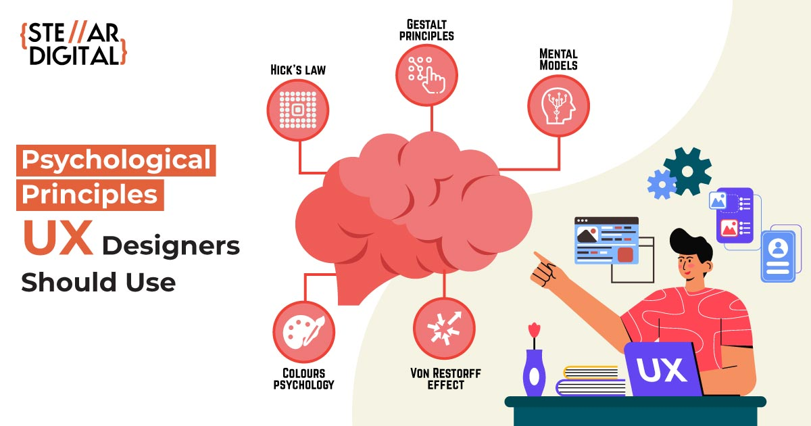

# Teorihandboken - UX och design (UD)
Studerande: Förnamn Efternamn
Mohamed abdi ali 
## UD 1.1 Grafik och design för webbsidor
 vad är Grafik och design för webbdsidor ?
 Webbgrafil och design till de koncept och principer som används för att skapa visuallt tilltalande och effectiva webbgränsnitt.Det är en integrerad del av webbdesign och ux användarupplelvelse, som täcker alla aspekter av estetik, layout och anvädarinteraktion.Här är några Viktiga delar av webbgrafik och design.
 Färgsättning det spelar en viktig roll för att skapa stämning och färmedla information på en webbsida.Webbdesigners väljer noggrant färgscheman för att skapa kontrastera en viktiga element och skapa en enhetlig visuell identitet.
 Att väljet en bra typografi det påverka användate på websidan sina läsbarheten och förstärka varumärke ich förbättra användarupplevelsen.

 Effektiv layout och struktur kan hjälpa användare att snabbt hitta på webbsidan. Det inkluderar placering av text, bilder, navigeringsmenyer och andra element för att skapa tydlig hierarki och användarflöde. Grafiska element som bilder, ikoner och illustrationer används för att förstärka information och engagera användare. Att optimera bilder för snabb laddning är också en viktig del av optimering av webbplats grafik Grafisk design för webbsidor inkluderar också att skapa responsiva layouter som anpassar sig till olika skärmstorlekar och enheter. Detta är avgörande med tanke på mängden olika enheter som används för att surfa på webben, inklusive datorer, surfplattor och smartphones.Grafik och design påverkar också webbplatsens prestanda. Optimerade bilder och grafik hjälper till att snabba upp sig laddningstider, vilket är avgörande för att behålla besökare och förbättra .Att hålla sig uppdaterad med de senaste trenderna och teknikerna är avgörande för att skapa en modern och konkurrenskraftig webbplats.

 </a>

## UD 1.2 UX och användbarhet
Beskriv rubriken här
vad är Ux och användbarhet ?
Användarupplevelse (UX) och användbarhet är kärnbegrepp inom produkt- och tjänstedesign och utveckling. Användarupplevelse strävar efter att skapa en positiv helhetsupplevelse för användare genom att förstå deras behov, beteenden och känslomässiga svar. Den täcker alla aspekter av design, från användargränssnitt till interaktion flöde, och strävar efter att skapa en meningsfull och effektiv användarresa.
Användbarhet är en specifik dimension av användarupplevelsen som fokuserar på hur användare interagerar med en produkt och uppnår sina mål effektivt. Användbara produkter är lätta att använda och minskar friktionen mellan användare och deras mål. Det handlar om att skapa produkter som är lätta att lära sig, effektiva att använda och tillfredsställande för användarna.
För att uppnå optimal användarupplevelse och användbarhet går designprocessen vanligtvis igenom olika stadier, inklusive användarforskning, prototyper, användartester och iterativa förbättringar. Att studera användarnas beteende och behov är avgörande för att skapa produkter som verkligen uppfyller användarnas förväntningar.
En effektiv användarupplevelse- och användbarhetsdesign tar hänsyn till många saker. Dessa inkluderar tillgänglighet för olika användargrupper, enheter och skärmstorlekar. Man strävar efter att skapa produkter och tjänster som inte bara möter användarnas krav utan också överträffar deras förväntningar och skapar lojalitet och positiv upplevelse över tid genom att prioritera enkelhet, tydlighet och tillfredsställelse. Sammanfattningsvis är användbarhet och användarupplevelse avgörande för att skapa varor och tjänster som inte bara är funktionella utan också engagerande och meningsfulla för användarna.
En viktig del av processen att göra produkter och tjänster användarvänliga är användarcentrerad design och användartestning. För att bättre förstå användarnas behov och förväntningar kan man involvera dem från början av designprocessen. Användartestning hjälper till att hitta potentiella problem med produkter innan de släpps, vilket leder till produkter som är mer anpassade till användarnas riktiga behov och beteende.

## UD 1.3 Riktlinjer för användbarhet
Beskriv rubriken här

vad är Riktlinjer för användbarhet?
En uppsättning principer och rekommendationer som kallas användbarhets riktlinjer används för att styra design och utveckling av produkter och tjänster för att maximera deras användbarhet. Dessa riktlinjer fokuserar på olika aspekter av design och interaktion för att förbättra användarupplevelsen. Följande är några vanliga användbarhet riktlinjer:
A)Klarhet och Transparens:
Klar och lättförståelig information: Se till att användargränssnittets text och innehåll är lätt att förstå.Kontinuerlig användning av ordförråd och terminologi: För att inte bli förvirrad, se till att använda samma ord och idéer.

B)Effektivitet:
Sänk antalet steg: Minimera antalet steg eller klick som krävs för att slutföra en uppgift
Snabb svar: Se till att systemet svarar snabbt på användarfrågor för att förhindra frustration.

C)Lätt att använda:
Simple learning: Designa produkten så att användare enkelt kan använda den.
Ett lättanvänt gränssnitt: Minska inlärningskurvan genom att använda välkända mönster och interaktioner.

D)Tolerans:
Erbjud alternativ: Tillåter användare att utföra uppgifter på en mängd olika sätt för att möta en mängd olika behov och förväntningar.
Inställningar som kan justeras: Ge användarna möjlighet att modifiera gränssnittet enligt deras önskemål.

E)Återkoppling och verifiering:
Klar feedback: Ge användare information om framgång eller problem.
Konfirmation diskussioner: Vid kritiska åtgärder användes dialogrutan för att bekräfta avsändarens avsikter.

F)Tillgång:
producera varor som är lätta att använda för individer med olika förmågor och funktionshinder.
För att öka tillgängligheten används universell design.
En grund för konsistens- och användarcentrerade lösningar är användbarhets riktlinjer. De används vanligtvis som referenspunkter under designprocessen och kan ändras enligt de specifika kraven och behoven för produkten eller tjänsten.

## UD 1.4 Prototyping
Beskriv rubriken här
vad är prototyping ?
Prototyper används under designprocessen för att testa och kommunicera designidéer genom att skapa modeller eller förebilder av en produkt eller ett system. Prototyping är en viktig del av användarupplevelse, design (UX) och produktutveckling, och det innebär att göra en simulerad version av en lösning för att undersöka dess funktioner, interaktioner och utseende. Här är några viktiga komponenter i prototyping: 
Testa  idéer:Designteamet kan prova ett antal idéer och koncept i en tidig utvecklingsfas genom att göra en prototyp. Det gör det möjligt för snabb validering och identifiering av eventuella problem eller möjligheter till förbättringar.
Kommunikation Styling:Prototyper hjälper utvecklare, designers och andra intressenter att kommunicera. De ger en tydlig bild av hur den slutliga produkten eller funktionen ska se ut och fungera.
Få användarkommentarer:Designern kan samla in feedback om användarupplevelse och användbarhet genom att låta användare interagera med en prototyp. Innan den slutliga implementationen hjälper detta till att upptäcka och lösa eventuella problem.

Fast iteration:En iterativ designprocess är möjlig genom att snabbt skapa och ändra prototyper. Det är möjligt att gradvis förbättra designen genom att ta hänsyn till feedback och insikter.
Se ljudet:De hjälper till att visualisera navigation strukturer och interaktion flöden som finns inom en produkt. Det visar produktens användares rörlighet.
För att minska riskerna för utveckling:Det är möjligt att minska riskerna och kostnaderna för felaktig implementering genom att testa och finjustera designen under prototyp fasen.
Responsiv konstruktion:Prototyper kan göras för att visa responsiv design, vilket innebär att produkten är anpassningsbar och ser bra ut på olika enheter och skärmstorlekar. Med tanke på hur många olika enheter som används idag, som datorer, surfplattor och smartphones, är det viktigt.
Målet med detaljerad prototyping är att skapa en produkt representation som är tillräckligt realistisk för att fånga användarens uppmärksamhet och ge en förståelse för hur den slutliga produkten kommer att fungera och se ut. Detta steg är avgörande för att säkerställa att produkten uppfyller användarnas behov och förväntningar.

## UD 1.5 Personas och målgruppsanalys
Beskriv rubriken här
vilken personas och målgruppsanalys?
Marknadsföring och UX-designer är två viktiga delar är individ- och målgruppsanalys, som hjälper till att förstå användarna och målgruppen bättre.
Att känna empati och förstå: Personer hjälper designers att förstå användarna bättre. Designers kan förstå användarnas behov och förväntningar och designa för dem genom att skapa fiktiva användarprofiler baserade på användarundersökningar och verkliga data.
Beslut angående design: Genom att upptäcka vilka funktioner och attribut som är viktiga för olika användargrupper hjälper människor till att sätta riktning för designbeslut. Det hjälper till att undvika förutsägelser och styr designen mot att vara användarcentrerad.
Funktioner prioriteras: Personas låter designteamet prioritera funktioner och designelement baserat på användarnas prioriteringar och beteenden. Det hjälper till att koncentrera resurserna på det som är mest relevant och värdefullt för målgruppen.
Analys av målgrupper inom användarupplevelse och design:
Medlemskap: Målgruppsanalys hjälper till att dela upp användarbasen och hitta olika grupper som har liknande behov och mål. Det gör det möjligt att designa och anpassa en produkt eller tjänst mer specifikt för olika konsumentgrupper.
Design som är användarcentrerad: En användarcentrerad designprocess bygger på målgruppsanalyser. Designers kan skapa en användarupplevelse som är enkel och tillfredsställande för användaren genom att känna till målgruppens preferenser och beteenden.
Individuell kommunikation: Målgruppsanalys hjälper till att göra marknadsföring och kommunikation specialiserad. Genom att veta vilka faktorer som är viktiga för olika målgrupper kan kommunikation och design anpassas för att passa vissa segment.
Förbättring av flödet: Målgruppens beteende kan hjälpa designers att optimera interaktion flöden och navigation strukturer. Detta gör det lättare för användarna att arbeta samtidigt som det minimerar irritationen.
Sammanfattningsvis är målgruppsanalyser och personas avgörande för UX och design eftersom de gör det möjligt för oss att förstå och rikta in oss på användarna. Dessa verktyg hjälper designteam att skapa varor och tjänster som inte bara är användbara utan också är relevanta för och tilltalar den specifika målgruppen.

 </a>

## UD 1.6 Empiriska metoder
Beskriv rubriken här
vad är Empiriska metoder ?
Empiriska forskningsmetoder inkluderar observation, uppmätning och insamling av empirisk data. Den här typen av data är baserad på erfarenhet snarare än abstrakta eller teoretiska överväganden. Empiriska metoder används inom en mängd olika discipliner, inklusive samhällsvetenskap, vetenskap och användbarhet, forskning och användardesign. Följande är några exempel på empiriska metoder och deras tillämpning:
Detta experiment:När det gäller vetenskap: Experiment involverar manipulation av oberoende variabler i syfte att undersöka hur de påverkar beroende variabler under kontrollerade förhållanden.
I UI-design: A/B-testning är en typ av experiment som jämför två versioner av en design för att avgöra vilken som presterar bättre när det gäller användarbeteende eller konverteringsfrekvens.
Formulär för undersökningar och frågor:
När det gäller vetenskap: Forskare samlar in data för att lära sig om deltagarnas åsikter eller upplevelser genom att använda enkäter eller frågeformulär.
I UI-design: Enkäter och användarundersökningar samlar in användarnas åsikter och preferenser, vilket hjälper till att fatta beslut om design och förbättringar.
Intervjuer som är kvalificerade:På vetenskaplig nivå: Forskare använder kvalitativa intervjuer för att bättre förstå deltagarnas upplevelser och synpunkter.När det gäller UX-design: Kvalitativa intervjuer används för att intervjua användare för att få mer information om deras beteende, behov och förväntningar.
Monitorering av ögon:På vetenskaplig nivå: Eye-tracking-teknik spårar människors ögonrörelser och undersöker hur de tittar på.När det gäller UX-design: Eye tracking hjälper designers att optimera layouten och placeringen av viktiga element genom att identifiera var användare fokuserar på en webbsida eller gränssnitt.
Användarkrav:När det gäller vetenskap: Att låta människor använda en produkt eller utföra en uppgift för att observera och mäta deras prestation och reaktioner kallas användartester.
I UI-design: Användartester är avgörande för att utvärdera en produkt eller tjänsts användbarhet genom att titta på hur användarna interagerar med den och hitta eventuella problem som kan uppstå.
Genom att använda empiriska metoder kan designers och forskare basera sina beslut och slutsatser på data och observationer i stället för enbart teoretiska resonemang. Detta gör att resultaten blir mer pålitliga och giltiga, och det leder ofta till bättre design och lösningar.

## UD 1.7 Grundläggande kognitionspsykologi
Beskriv rubriken här

vad är Grundläggande kognitionspsykologi ?
I UX-design används grundläggande kognitionspsykologi för att förstå och optimera användarupplevelsen i digitala produkter och gränssnitt. Designers kan utveckla produkter som är mer användarcentrerade genom att ta hänsyn till hur människor tänker, uppfattar och bearbetar information. Här är några exempel på hur grundläggande kognitionspsykologi används i UX-design:
Kognitionspsykologi, även om feedback ger information om resultatet av en handling, är förmågor egenskaper hos ett objekt som indikerar hur det kan användas.
UI-design: För att hjälpa användarna att förstå hur man använder produkten och vad som händer som ett resultat av deras handlingar, så visar designern affordances tydligt och ger direkt feedback på användar integrationerna.  Adaption till mänskliga känslor:
Perception och visualisering: Använd layout, kontraster och färger för att öka visuell uppfattning. För att skapa användargränssnitt som är lätta att förstå och lätta att förstå, följ gestaltlagar.
Hörförmåga: Tydliga ljudindikatorer och ljudanvändning förbättrar användarupplevelsen, särskilt under viktiga händelser.
Minimera kognitiv stress:Simple Design: Förse ett användargränssnitt som är enkelt och lätt att förstå för att minska komplexiteten. Undvik onödiga beslut och processer.
Transparent informationsstruktur: organisera logiskt information och navigations flöden så att användaren inte behöver tänka för mycket.
Tydliga möjligheter: Använd tydliga designelement och visuella signaler för att visa användare hur de interagerar med gränssnittet och dess olika delar.
Responsiv respons: För att skapa en koppling mellan åtgärden och dess resultat ger feedback som är direkt och förståeligt när användare utför handlingar.
Datorarkitektur: Strukturera innehållet så att det är lätt att komma ihåg och återkalla. Använd kategorier och hierarkier för att logiskt organisera data.
Tydlig märkning: Stöd igenkänning och minnesprestanda med tydliga och konsekventa etiketter och ikoner.
Designers kan skapa varor och tjänster som inte bara är funktionella utan också passar användarnas naturliga kognitiva processer genom att integrera grundläggande kognitionspsykologi i UX-designprocessen. Detta leder till en mer fokuserad och tillfredsställande användarupplevelse.

Sammanfattning: Grundläggande kognitionspsykologi används i UX-design för att förstå och förbättra användarupplevelsen i digitala produkter och gränssnitt. Designers kan skapa produkter som är fokuserade på användaren genom att ta hänsyn till hur människor tänker och bearbetar information. Tydliga affordances och feedback i UI-design, anpassning till mänskliga sinnen genom perceptuell och auditiv design, och enkel och transparent informationsstruktur för att minska kognitiv stress är exempel på tillämpningar. Användarnas minnesprestanda stöds genom att organisera innehållet och använda tydlig märkning. Sammantaget gör kognitionspsykologi det möjligt för användaren att vara fokuserad och nöjd.
 

 </a>

## källor

https://www.ibm.com/blogs/think/se-sv/2021/01/11/vad-ar-ux-design-egentligen/ 

https://www.konstuppdrag.se/grafisk_design 
https://klingit.com/se/blog/vad-ar-ux-design/ 

https://raidboxes.io/sv/blog/webdesign-development/ux-design-usability/ 

https://www.fiverr.com/yoma70/design-modern-ui-ux-design-for-mobile-apps-and-websites-design-and-landing-page 

https://dribbble.com/shots/16520422-Food-Delivery-App-Design 

https://www.stellardigital.in/blog/5-psychology-principles-for-creating-effective-ux-design/ 